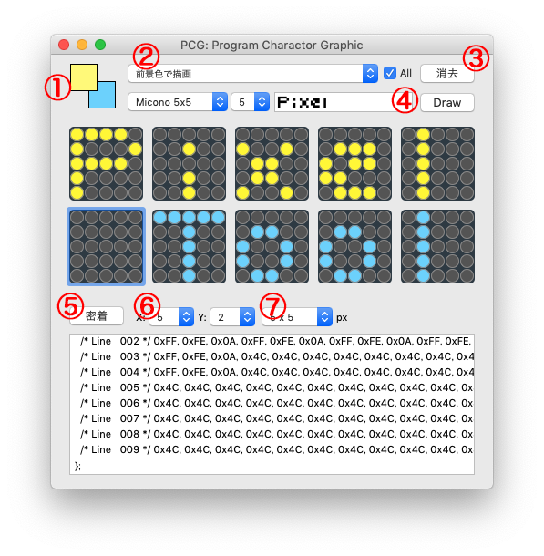

# PixelTool for Atom

M5StackのAtomのPCG編集用のアプリです。
マック版とウインドウズ版を入れましたが、Windows版の動作テストは行なっていません。

## 使い方

- お好みにより同梱のmic5x5.ttfをダブルクリックして入れて下さい。
- 保存はメニューバーのファイルの「保存」でできます。
- 保存したファイルを開く場合は、メニューバーのファイルの「開く」でできます。

1. 前景色、背景色を設定します。
2. 各種機能（Allにチェックが入っている場合、全グリッドが対象になります）
3. 消去（Allにチェックが入っている場合、全グリッドが対象になります）
4. 書いた文字を「描画」ボタンでグリッドに描画します。5x5サイズのフォントを使った方がいいと思います。
5. グリッドを密着させたり分離させたりできます。
6. グリッドの縦と横の数を選びます。
7. グリッドのピクセル数を選びます。

### 更新履歴

v1.0.0b1 (2020/6/21)

- 公開

## 免責、ライセンス

- このプログラムなどを利用したことによりトラブルに関して、Micono Utilitiesは一切の責任を負いません。各自の責任においてご利用ください。
- このソフトウエアに関して、M5Stack社とはなんら関係ありません。
- CC BY Micono Utilities
